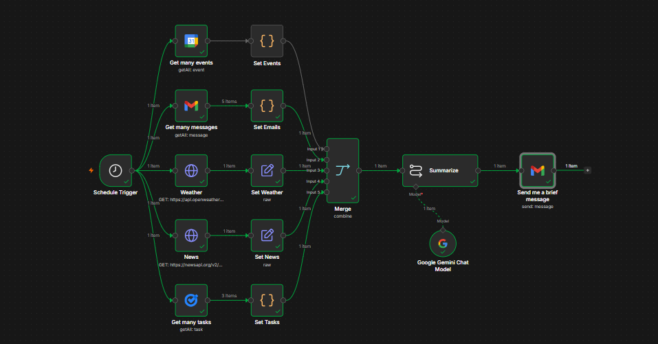

# 🧠 AI Executive Daily Brief

An n8n workflow that automates my morning routine: it pulls today's calendar events, unread emails, the weather, top news, and open tasks, summarizes all of it with Google Gemini, and emails me a single clean brief — so I don't have to open 5 apps every morning.

## 🎯 Problem it solves

Every morning I was manually checking Google Calendar, Gmail, a weather app, a news app, and Google Tasks just to know what my day looked like. This workflow collects all of that automatically on a schedule and delivers it as one short email.

## ⚙️ How it works

| Step | Node(s) | What it does |
|---|---|---|
| 1 | **Schedule Trigger** | Kicks off the workflow every morning |
| 2 | **Get many events** (Google Calendar) → **Set Events** | Pulls today's calendar events |
| 3 | **Get many messages** (Gmail) → **Set Emails** | Pulls recent unread messages |
| 4 | **Weather** (HTTP Request → OpenWeatherMap) → **Set Weather** | Pulls today's weather for my city |
| 5 | **News** (HTTP Request → NewsAPI) → **Set News** | Pulls top headlines |
| 6 | **Get many tasks** (Google Tasks) → **Set Tasks** | Pulls open to-dos |
| 7 | **Merge** (combine, 5 inputs) | Combines all 5 branches into one item |
| 8 | **Summarize** (Google Gemini Chat Model) | Turns the combined data into a short, readable brief |
| 9 | **Send me a brief message** (Gmail) | Emails the final summary |

## 🔑 Requirements

To run this yourself, you'll need:

- An [n8n](https://n8n.io) instance (self-hosted or cloud)
- **Google Calendar** OAuth2 credential
- **Gmail** OAuth2 credential (read + send scopes)
- **Google Tasks** OAuth2 credential
- **Google Gemini API key** (for the Summarize node)
- **OpenWeatherMap API key** — [get one here](https://openweathermap.org/api)
- **NewsAPI key** — [get one here](https://newsapi.org)

> ⚠️ Google's default OAuth apps in "Testing" mode expire refresh tokens every 7 days. If you hit constant reconnection errors, switch your Google Cloud OAuth consent screen to **Production**, or use a **Google Service Account** for a token that never expires.

## 🚀 Setup

1. Import `AI-Executive-Daily-Brief.json` into your n8n instance.
2. Open each Google node (Calendar, Gmail, Tasks) and connect your own credentials.
3. In the **Weather** and **News** HTTP Request nodes, replace `YOUR_OPENWEATHER_API_KEY` and `YOUR_NEWSAPI_KEY` with your own keys.
4. In the **Get many events** node, replace the calendar ID with your own (usually your Gmail address or `primary`).
5. In the **Send me a brief message** node, replace the recipient with your own email.
6. In the **Summarize** node, connect your own Google Gemini credential.
7. Activate the workflow, or run it manually to test.

## 📬 Sample output

## 🛠 Built with

[n8n](https://n8n.io) · Google Calendar API · Gmail API · Google Tasks API · Google Gemini · OpenWeatherMap API · NewsAPI

## 📄 License

MIT — free to use, modify, and share.
